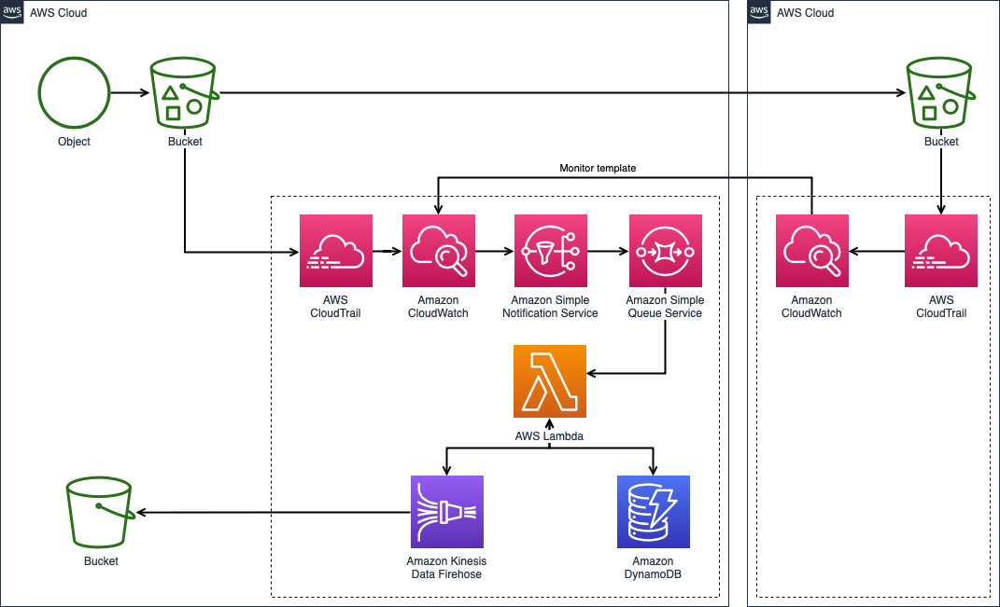

# SpeedVote
A highly scalable and available mobile voting system.

## Users
- Admin
- Election Officer
- KYC Officer
- Voter

## Workflows
Public workflows 

### User Registration
- Anonymous user applies for an account using a unique email
- Email is verified and the account is created with a "For Verification" status
- A verification request is sent to the KYC Officer
- The KYC officer approves the verification status of the user
- The user is now a legit Voter

### Election
- Election Officer prepares the Questions
- Election officer locks down the Questions and broadcasts them to the user (at this point the questions are prepared but not yet ready for use)
- When the "unlock time" has passed, the users are now allowed to participate in the election process

### Tech Stack
- CloudFormation
- Proton
- DynamoDB
- Lambda
- Cognito
- AppSync
